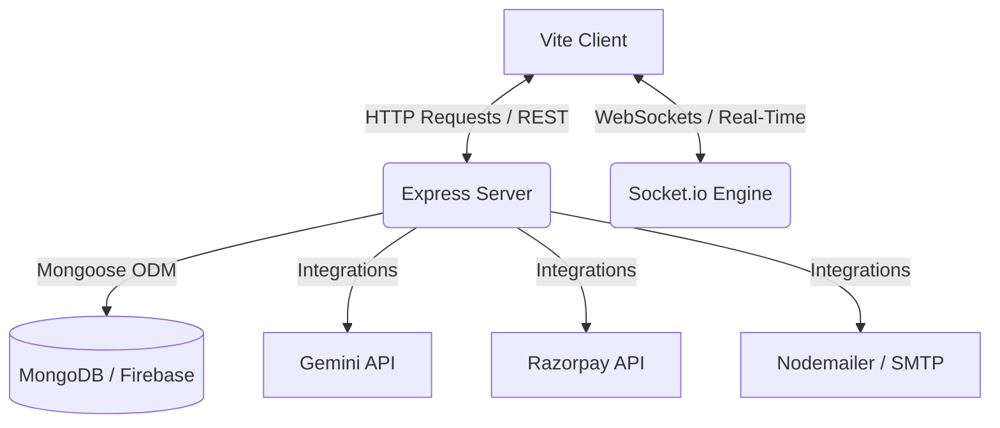

# 🚂 Palamu Express — Premium News Delivery Portal

> A state-of-the-art, production-ready, and highly performant MERN-stack news delivery platform customized for Jharkhand under the **Palamu Express** brand. It features a complete district-wise hierarchy, role-based editorial workflows, reporter KYC onboarding with dynamic ID card generation, live SMTP email/OTP notifications, active page-view tracking via WebSockets, ad monetization with Razorpay, and Gemini AI-assisted news summarization.

---

<div align="center">

[](https://react.dev)
[](https://nodejs.org)
[](https://www.mongodb.com)
[](https://socket.io)
[](https://deepmind.google/technologies/gemini/)

</div>

---

## 🌟 Key Features & Workflows

### 🛡️ 1. Multi-Role Onboarding & KYC
* **Reporter KYC**: Detailed onboarding application where reporters supply details and credentials.
* **Smart Approvals**: Editors/Admins review applications. Approving a reporter instantly compiles a premium, downloadable **Reporter ID Card PDF** using canvas/PDF compilation templates.
* **Onboarding Feedback**: Rejections dispatch real-time email notification feedback to the reporter with rejection details.

### 📝 2. Dynamic Editorial Pipeline
* **Role Hierarchy**: Reconciles workflows between `Reporter`, `Chief Editor`, `Admin`, `Advertiser`, and `Reader`.
* **Submit -> Review -> Publish**: Reporters write drafts and submit. Chief Editors or Admins review, request changes, or approve/publish them live.
* **District Focus**: Articles cataloged by Jharkhand's districts (e.g., Palamu, Garhwa, Latehar) to construct highly targeted local feeds.

### 🤖 3. Smart AI Summarization
* **Gemini Integration**: Long articles are processed on-demand using Google's **Gemini Pro model** to compile concise, bulleted key takeaways, providing readers with quick digests.

### 📈 4. Real-Time Viewership & WebSockets
* **Live Updates**: Utilizes `Socket.io` rooms. When users view a particular article, the current live viewer tally dynamically updates across all client sessions without page refreshes.
* **Engagement Insights**: Visualizes readership analytics on the chief editor and admin dashboards.

### 💸 5. Monitized Ad Engine with Razorpay
* **Self-Serve Advertising**: Advertisers can purchase ad slots directly.
* **Payment Linkage**: Plugs directly into the Razorpay Checkout API. Upon successful payment verification on the backend, the ad campaign goes live immediately.

### ✉️ 6. SMTP Mailer System
* **Instant Alerts**: Custom transactional mailer triggers verification codes, account status updates (approvals/rejections), and administrative notices.

---

## 💻 Tech Stack & Architecture

> [!NOTE]
> The codebase utilizes **NPM Workspaces** to coordinate dependency tracking and execution between the frontend and backend effortlessly.



### Frontend Workspace (`/client`)
- **Core Framework**: React 18 with Vite for ultra-fast HMR builds.
- **Styling**: Tailwind CSS combined with fluid custom premium CSS styling (`client/src/styles/index.css`).
- **State & Routing**: React Router DOM (client routing), React Context (Authentication & UI state).
- **Libraries**: Lucide React (icons), Socket.io-client, Axios.

### Backend Workspace (`/server`)
- **Runtime**: Node.js with modern ES Module imports (`import/export`).
- **Core Server**: Express.js with custom middleware (`helmet`, `cors`, `morgan`, `rate-limit`, `cookie-parser`).
- **Real-Time Integration**: Socket.io server integrated directly into the HTTP listener.
- **Database Layer**: MongoDB (via Mongoose) and Firebase Firestore / Firebase Storage via Firebase Service Account integration.
- **Utilities**: NodeMailer (for SMTP emails), JSON Web Tokens (`jsonwebtoken`), PDF generation engines.

---

## 📂 Project Structure

```text
├── client/                      # React Frontend App
│   ├── src/
│   │   ├── components/          # Reusable UI, news, and dashboard components
│   │   ├── data/                # Static lists (e.g. Jharkhand districts data)
│   │   ├── pages/               # Page layouts (Login, Articles, Admin Dashboard, KYC)
│   │   ├── styles/              # Global css and theme variables
│   │   └── App.jsx              # Main routing and provider setup
│   └── package.json
│
├── server/                      # Express + WebSockets Backend App
│   ├── src/
│   │   ├── config/              # Firebase, MongoDB, and mailer setups
│   │   ├── controllers/         # Request handling & integrations (Auth, Articles, Ads, Gemini)
│   │   ├── models/              # Mongoose DB Schemas (User, Article, Ad, Notification)
│   │   ├── routes/              # Express API endpoints
│   │   ├── socket/              # Socket.io analytics handlers
│   │   ├── utils/               # Constants, SMTP mailer configurations, and helpers
│   │   └── server.js            # Express server initialization
│   └── package.json
│
├── docs/                        # Complete API & Deployment Guides
│   ├── API.md
│   └── DEPLOYMENT.md
│
├── package.json                 # Monorepo Workspace configuration
└── README.md                    # Main entry manual
```

---

## 🔑 Environment Variables Configuration

To run Palamu Express, create the following `.env` files in their respective folders:

### 📡 Server Environment (`server/.env`)
```env
PORT=5000
CLIENT_URL=http://localhost:5173
MONGODB_URI=mongodb://127.0.0.1:27017/palamu-express
JWT_SECRET=your_jwt_secret_key_here
JWT_EXPIRES_IN=7d

# Live SMTP Configuration
SMTP_HOST=smtp.gmail.com
SMTP_PORT=587
SMTP_USER=your-email@gmail.com
SMTP_PASS=your-gmail-app-password
SMTP_SECURE=false

# Third-Party Integrations
CLOUDINARY_CLOUD_NAME=your_cloud_name
CLOUDINARY_API_KEY=your_api_key
CLOUDINARY_API_SECRET=your_api_secret

RAZORPAY_KEY_ID=your_razorpay_key_id
RAZORPAY_KEY_SECRET=your_razorpay_key_secret

GEMINI_API_KEY=your_gemini_api_key

# Firebase Credentials
FIREBASE_PROJECT_ID=palamu-express-web-ea2fc
FIREBASE_STORAGE_BUCKET=palamu-express-web-ea2fc.firebasestorage.app
```

### 💻 Client Environment (`client/.env`)
```env
VITE_API_URL=http://localhost:5000/api
VITE_SOCKET_URL=http://localhost:5000
```

---

## 🛠️ Quick Start Guide

### 1. Prerequisite Setup
* Ensure **Node.js** (v18 or higher) is installed.
* Make sure a local instance of **MongoDB** is running, or plug in a MongoDB Atlas connection string in the `server/.env`.
* If you are running Firebase, store your firebase service key credentials at `server/.firebase-service-account.json` (this file is ignored in Git to prevent security leaks).

### 2. Dependency Installation
Run the following command at the **root directory** to install dependencies for all workspaces at once:
```bash
npm install
```

### 3. Running the App Locally
Run the concurrent development server from the **root directory**:
```bash
npm run dev
```

* **Client Dashboard & Portal**: [http://localhost:5173/](http://localhost:5173/)
* **API Base Endpoint**: [http://localhost:5000/api/](http://localhost:5000/api/)

---

## 📡 API Reference Overview

Below is a summary of the core endpoints. For complete details, consult [docs/API.md](file:///c:/Users/91766/Palamu-Express-Web/docs/API.md).

| Method | Endpoint | Description | Access Role |
| :--- | :--- | :--- | :--- |
| **POST** | `/api/auth/register` | Registers a new user/reporter profile | Public |
| **POST** | `/api/auth/login` | Logins in user, returning JWT and credentials | Public |
| **PATCH** | `/api/users/:id/approve` | Approves reporter/editor KYC onboarding | Admin / Chief Editor |
| **PATCH** | `/api/users/:id/reject` | Rejects KYC onboarding with feedback | Admin / Chief Editor |
| **GET** | `/api/articles/homepage/feed` | Pulls main categories, trending and district stories | Public |
| **POST** | `/api/articles` | Submits draft article to editor pipeline | Reporter |
| **PATCH** | `/api/articles/:id/approve` | Approves and publishes the draft article | Admin / Chief Editor |
| **POST** | `/api/articles/:id/summarize`| Generates bulleted Gemini AI text summary | Registered User |
| **POST** | `/api/ads` | Initializes ad details and Razorpay billing | Advertiser |
| **PATCH** | `/api/ads/:id/verify-payment`| Verifies backend payment signature & starts campaign | Advertiser |
| **GET** | `/api/analytics` | Returns real-time viewed article rankings | Admin / Chief Editor |

---

## 🔒 Production Hardening Checklist

Prior to launching onto production (`Vercel` / `Render` / `AWS`):
- [ ] Replace Gmail/SMTP test stubs with a production email delivery provider (e.g. SendGrid or Amazon SES).
- [ ] Transition the development phone OTP stub to a live SMS Gateway (e.g. Twilio).
- [ ] Securely configure all backend production keys via environment-manager vaults.
- [ ] Add production Razorpay webhook handlers to secure billing state.
- [ ] Run production build locally (`npm run build`) to ensure all compilation rules and TypeScript/Vite rules pass.

---
*Created and maintained under the Palamu Express brand. For questions, bug reports, or feature enhancements, open a Pull Request!*
